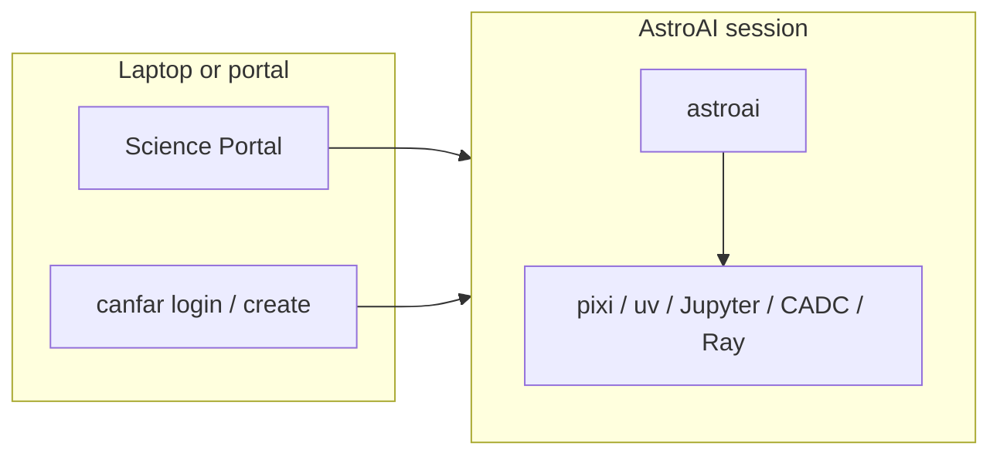

# astroai-lab

The **`astroai`** CLI you run *inside* an AstroAI session on the
[CANFAR Science Platform](https://www.opencadc.org/canfar/).

Start and stop sessions with [`canfar`](https://github.com/opencadc/canfar)
(or the Science Portal). Inside the session, `astroai` does three jobs:

1. **Project env** — `init` / `clone` / `save` / `resume` (lockfiles on `/arc`)
2. **Ray cluster** — `cluster start` / `status` / `run` / `jobs`
3. **Agents** — `agent setup` / `install` / `verify`



| Name | Meaning |
|------|---------|
| **AstroAI** | Product: GitHub [`astroai`](https://github.com/astroai), Harbor `astroai` |
| **CANFAR** | Host platform: portal, Skaha, `/arc`, auth |
| **`canfar`** | Platform CLI — sessions and `canfar data` |
| **`astroai`** | This package, inside a session |
| **`images.canfar.net/astroai/*`** | Session images |

Images: [canfar-containers](https://github.com/astroai/canfar-containers).

## Inside a session

```bash
astroai                         # status banner
astroai init mylab              # or: clone owner/repo
astroai save                    # lockfile snapshot to /arc
astroai resume mylab
astroai status                  # quotas, sessions (not the Ray cluster)

astroai cluster start
astroai cluster status
astroai run train.py --cpus 2

astroai kernel ensure
astroai agent setup
```

`astroai status` is this session’s CPU/disk/quota. `astroai cluster status`
is whether the Ray cluster is up. `astroai cluster stop` tears down workers
and the manager.

Help: `astroai help` · one command: `astroai help -c cluster` · cheat sheet:
[docs/help.md](docs/help.md)

## Install

Session images already put `astroai` on PATH.

```bash
pipx install git+https://github.com/astroai/canfar-lab.git
# or: pip install "git+https://github.com/astroai/canfar-lab.git"
pixi install && pixi run astroai --help   # checkout
```

## Docs

| Doc | What it is |
|-----|------------|
| [docs/help.md](docs/help.md) | Cheat sheet |
| [docs/USAGE.md](docs/USAGE.md) | Storage, workflows, Ray, agents |
| [docs/cli.md](docs/cli.md) | Flags and every command |
| [docs/config.md](docs/config.md) | Optional `~/.astroai/lab/config.yaml` |
| [docs/concurrency.md](docs/concurrency.md) | Shared home: locks, atomic writes, agent runtime placement |

Data movement is not this CLI. Use **`canfar data`** and `vcp` / `vls`.

## Development

```bash
./scripts/ci.sh
pixi run test
```

[MIT](LICENSE). `canfar` keeps its own license.
